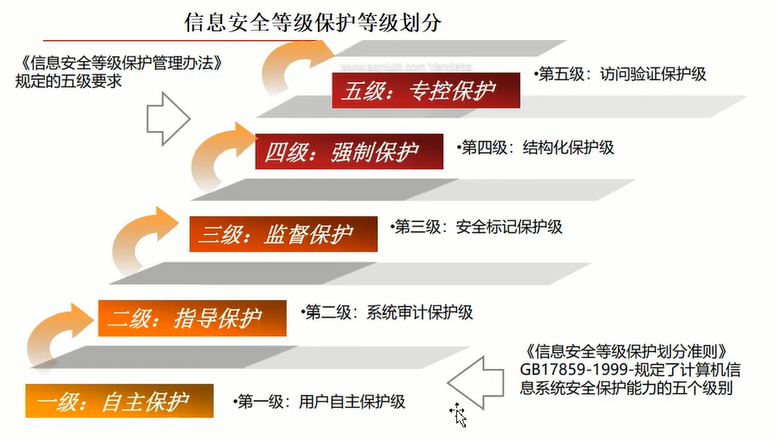
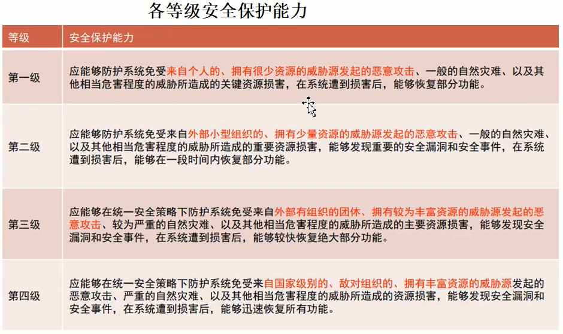
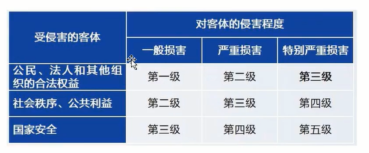
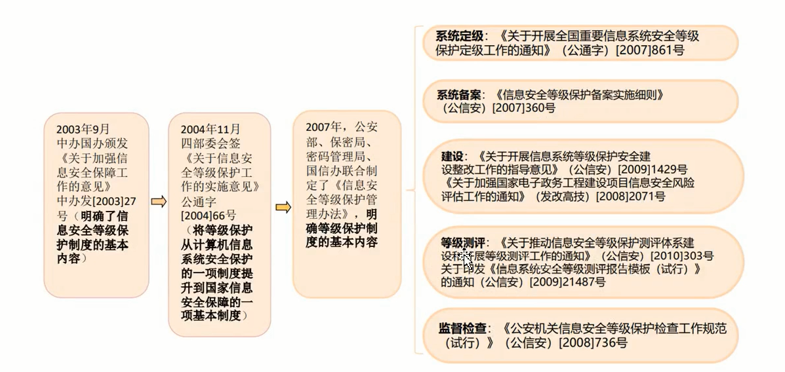
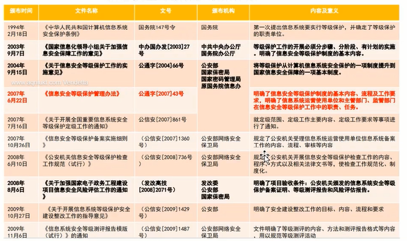
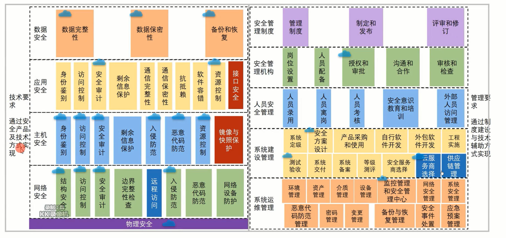

# 信息安全等级保护制度

## 等级保护意义

以下的内容都是基于较早年代的讲述:

1. 在党中央、国务院高度重视和全社会共同努力下，我国信息网络安全工作取得了很大发展，但是我国信息安全工作起步晚，基础薄弱，信息网络安全面临的形势依然十分严峻。
2. 社会对网络信息内容安全的认识普遍提高，但对网络自身的安全性却认识不足。(些单位片面认为内部使用的信息网络就是安全的，因而缺乏网络安全保护的意识和能力)网络安全建设和管理存在很大的盲目性。(有的人认为，安装了防火墙、防病毒、入侵检测等设备的网络就是安全的)
3. 对信息网络安全保护工作的监测管理薄弱。(对信息网络的安全监督检查，多数停留在对安全管理制度、人员及一般性地技术检查，缺乏有效的技术检查标准和检测工具，工作难以深入)
4. 规范化、高水平的信息网络安全服务市场还未形成。(由于信息网络安全的专业性强，专门人才有限，而社会上专业化程度高、专门从事网络安全技术咨询、风险分析、检测评估等业务的网络安全服务机构极为缺乏，难以为全社会提供足够的网络安全技术支持和服务。

## 等级保护制度的确立

党中央、国务院高度重视信息安全保障工作。1994年国务院颁布的《中华人民共和国计算机信息系统安全保护条例》(147号令) 规定，“计算机信息系统实行安全等级保护，安全等级的划分标准和安全等级保护的具体办法，由公安部会同有关部门制定”，要求实行安全等级保护。1999年，国家质量技术监督局正式发布了强制性国家标准:GB 17859- 1999: 《计算机信息系统安全保护等级划分准则》(以下简称 《划分准则》)。

2003年7月，国家信息化领导小组第三次会议专门研究信息安全问题，审议通过《国家信息化领导小组关于加强信息安全保障工作的意见》(中办发[2003] 27号)，提出了今后一段时期我国信息安全保障工作的总体要求和主要原则，首次明确了信息安全等级保护制度是我国信息安全保障工作的基本制度。

## 等级保护主要内容

1. 公安、国家保密、国家密码管理、技术监督、信息产业等国家有关信息网络安全的行政主管部门要在国家信息化领导小组的统一领导下，制定我国开展信息网络安全等级保护工作的发展政策，统--制定针对不同安全保护等级的管理规定和技术标准，对不同信息网络确定不同安全保护等级和实施不同的监督管理措施。
2. 等级保护坚持“谁主管、谁负责，谁经营、谁负责，谁建设、谁负责，谁使用、谁负责”的原则。
3. 等级保护实行“国家主导、重点单位强制、一般单位自愿;高保护级别强制、低保护级别自愿”的监管原则。
4. 信息系统安全状况等级的检测评估是等级保护的重点。
5. 等级保护制度为信息网络安全产品的普及使用提供了广阔的市场和发展空间。

## 等级保护遵循的准则

2004年9月15日，由公安部、国家保密局、国家密码管理局和国信办联合下发《关于信息安全等级保护工作的实施意见》(66号 文件)，明确信息安全等级保护的核心是对信息安全分等级、按标准进行建设、管理和监督。信息安全等级保护制度
遵循以下基本原则:

- 明确责任，共同保护
- 依照标准，自行保护
- 同步建设，动态调整
- 指导监督，重点保护

## 等级划分与保护管理

2007年6月22日由公安部、国家保密局、国家密码管理局和国信办联合下发《信息安全等级保护管理办法》(43号文件)，规范了信息安全等级保护的管理，将信息系统的安全保护等级分为以下五级:
|等级|描述|
|--|--|
|一级|信息系统受到破坏后，会对公民、法人和其他组织的合法权益造成损害，但不损害国家安全、社会秩序和公共利益。|
|二级|信息系统受到破坏后，会对公民、法人和其他组织的合法权益产生严重损害，或者对社会秩序和公共利益造成损害，但不损害国家安全。|
|三级|信息系统受到破坏后，会对社会秩序和公共利益造成严重损害，或者对国家安全造成损害。|
|四级|信息系统受到破坏后，会对社会秩序和公共利益造成特别严重损害,或者对国家安全造成严重损害。|
|五级|信息系统受到破坏后，会对国家安全造成特别严重损害。|

信息系统运营、使用单位依据《管理办法》和相关技术标准对信息系统进行保护，国家有关信息安全监管部门对其信息安全等级保护工作进行监督管理。

|等级|描述|
|--|--|
|一级|信息系统运营、使用单位应当依据国家有关管理规范和技术标准进行保护。|
|二级|信息系统运营、使用单位应当依据国家有关管理规范和技术标准进行保护。国家信息安全监管部门对该级信息系统信息安全等级保护工作进行指导。|
|三级|信息系统运营、使用单位应当依据国家有关管理规范和技术标准进行保护。国家信息安全监管部门对该级信息系统信息安全等级保护工作进行监督、检查。|
|四级|信息系统运营、使用单位应当依据国家有关管理规范、技术标准和业务专门需求进行保护。国家信息安全监管部门对该级信息系统信息安全等级保护工作进行强制监督、检查。|
|五级|信息系统运营、使用单位应当依据国家管理规范、技术标准和业务特殊安全需求进行保护。国家指定专门部门对该级信息系统信息安全等级保护工作进行专门监督、检查。|

## 等级保护工作中的角色责任和义务

2007年由公安部颁布了《信息系统安全等级保护实施指南》(信 安字[2007]10号)，该标准详细规定了等级保护工作中涉及的各类角色和职责如下:

- 国家管理部门

  公安机关负责信息安全等级保护工作的监督、检查、指导;国家保密工作部门负责等级保护工作中有关保密工作的监督、检查、指导;国家密码管理部门负责等级保护工作中有关密码工作的监督、检查、指导;涉及其他职能部门管辖范围的事项，由有关职能部门依照国家法律法规的规定进行管理;国务院信息化工作办公室及地方信息化领导小组办事机构负责等级保护工作的部门间协调。

- 信息系统主管部门

  负责依照国家信息安全等级保护的管理规范和技术标准，督促、检查和指导本行业、本部门或者本地区信息系统运营、使用单位的信息安全等级保护工作。

- 信息系统运营、使用单位负责依照国家信息安全等级保护的管理规范和技术标准，确定其信息系统的安全保护等级，有 主管部门的，应当报其主管部门审核批准;根据已经确定的安全保护等级，到公安机关办理备案手续;按照国家信息安全等级保护管理规范和技术标准，进行信息系统安全保护的规划设计;使用符合国家有关规定， 满足信息系统安全保护等级需求的信息技术产品和信息安全产品，开展信息系统安全建设或者改建工作;制定、落实各项安全管理制度，定期对信息系统的安全状况、安全保护制度及措施的落实情况进行自查，选择符合国家相关规定的等级测评机构，定期进行等级测评;制定不.同等级信息安全事件的响应、处置预案，对信息系统的信息安全事件分等级进行应急处置。
- 信息安全服务机构负责根据信息系统运营、使用单位的委托，依照国家信息安全等级保护的管理规范和技术标准，协助信息系统运营、使用单位完成等级保护的相关工作，包括确定其信息系统的安全保护等级、进行安全需求分析、安全总体规划、实施安全建设和安全改造等。
- 信息安全等级测评机构负责根据信息系统运营、使用单位的委托或根据国家管理部门的授权，协助信息系统运营、使用单位或国家管理部门，按照国家信息安全等级保护的管理规范和技术标准，对已经完成等级保护建设的信息系统进行等级测评;对信息安全产品供应商提供的信息安全产品进行安全测评。
- 信息安全产品供应商负责按照国家信息安全等级保护的管理规范和技术标准，开发符合等级保护相关要求的信息安全产品，接受安全测评;按照等级保护相关要求销售信息安全产品并提供相关服务。

## 安全等级保护的主要工作环节

我国信息安全等级保护制度分为以下五个主要的工作环节:信息系统定级、信息系统备案、安全建设整改、安全等级测评和安全监督检查。

## 等级保护政策体系

