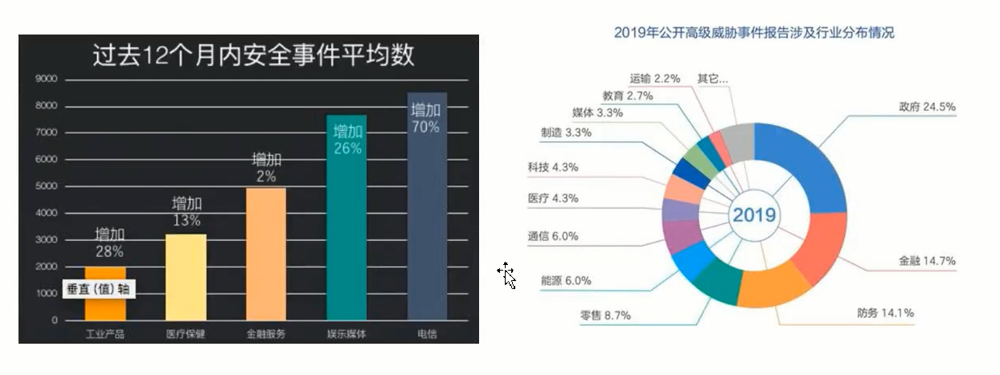
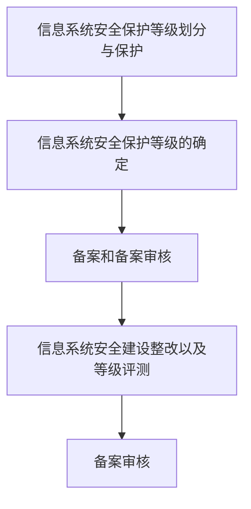
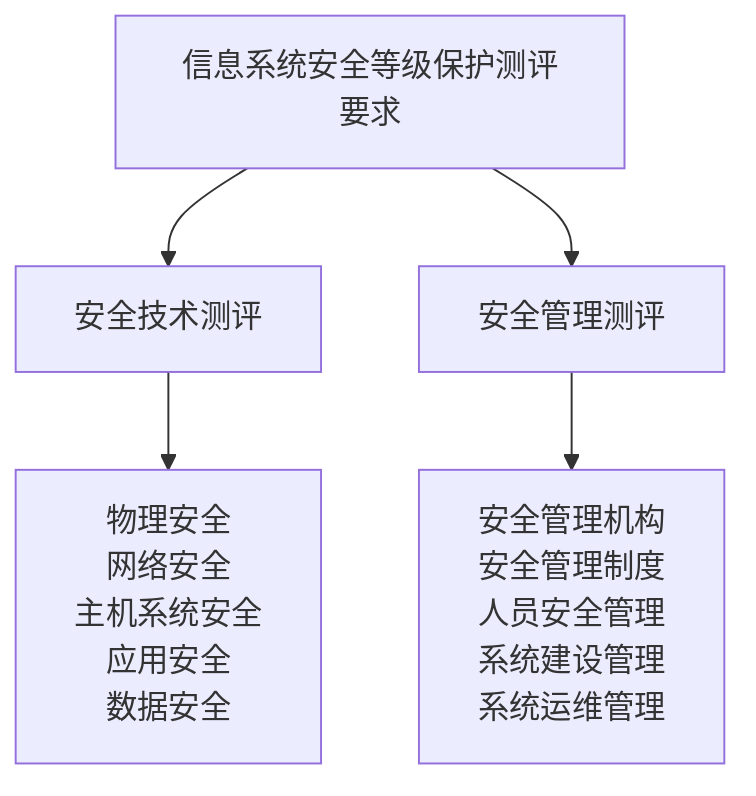

# 信息安全等级保护

## 等级保护的目的

国际上计算机犯罪正以每年100%的速度增长。在Internet. 上的黑客攻击事件也以每年10倍的速度在增长:计算机病毒从1998年发现首例以来,增长的速度呈几何级数。据美国审计总署资料:世界上120余个国家已经或正在研究进入计算机网络的手段。1995年，入侵美国国防部计算机网络的事件多达25万次，其中65%(16.25万次)获得了成功。欧美等国金融机构的计算机网络被入侵的比例高达77%,我国近几年来计算机犯罪也以30%的球度在增长。国内90%以上的电子商务网站存在严重的安全漏洞。

## 等级保护的实施步骤

## 测评方法和意义

等级测评和自查要求：

《管理办法》第十四条规定，信息系统建设完成后，运营、便用单位或者其主管部门应当选择符合本办法规定条件的测评机构，依据《信息系统安全等级保护测评要求》等技术标准，定期对信息系统安全等级状况开展等级测评。第三级信息系统应当每年至少进行一次等级测评，第四级信息系统应当每半年至少进行一次等级测评，第五级信息系统应当.依据特殊安全需求进行等级测评。经测评或者自查，信息系统安全状况未达到安全保护等级要求的，运营、使用单位应当制定方案进行整改。

安全技术测评如下：
| 技术         | 防范内容                                                     |
| ------------ | ------------------------------------------------------------ |
| 物理安全     | 设备位置是否防盗窃，防火防水防潮防静电等                     |
| 网络安全     | 网络访问控制，网络安全审计，边界检查，恶意代码防范，监视端口扫描，木马，ddos，缓冲区溢出等，用户身份鉴别等 |
| 主机系统安全 | 身份鉴别，访问控制，安全审计                                 |
| 应用安全     | 通信完整性，保密性，代码安全                                |
| 数据安全     | 数据的完整性，保密性等                                     |

安全管理测评如下：

| 管理         | 管理内容                                                     |
| ------------ | ------------------------------------------------------------ |
| 安全管理机构 | 岗位设置，人员配备，授权和审批，沟通和合作，审核和检查       |
| 安全管理制度 | 管理制度、制定和发布、评审和修订                             |
| 人员安全管理 | 人员录用，人员离岗，人员考核，安全意识教育和培训，第三方人员访问管理 |
| 系统建设管理 | 系统定级，安全方案设计，产品采购，自行软件开发，外包软件开发，工程实施，测试验收，系统交付，安全服务商选择 |
| 系统运维管理 | 环境管理，资产管理，介质管理，设备管理，监控管理，网络安全管理，系统安全管理，恶意代码防范管理，密码管理，变更管理，备份与恢复管理，安全事件处置，应急预案管理 |

## 测评实施

1. 确定资产与边界（范围）

   - 操作系统

   - 网络设备

2. 测评项目
   - 安全技术测评
     - 物理安全
     - 网络安全
     - 主机系统安全
     - 应用安全
     - 数据安全
   - 安全管理测评
     - 安全管理机构
     - 安全管理制度
     - 人员安全管理
     - 系统建设管理
     - 系统运维管理
3. 人员访谈
   - 测试人员
      - 针对组织内的安全管理人员、安全员、安全主管、工作人员、关键活动批准人、管理人员（负责定期评审、修订和日常维护的人），机房值守人员、人事负责、人事工作人员、审计人员、网络管理员、文档管理员、物理安全负责人、系统管理员、系统建设负责人、系统运维负责人、资产管理员等不同类型岗位的人员访谈。

   - 测试方法
      - 访谈

4. 文档检查
   - 测试内容
      - 安全管理机构、安全管理制度、人员安全管理、系统建设管理、系统运维管理等方面的文档检查

   - 测试方法
      - 查看相关文件

