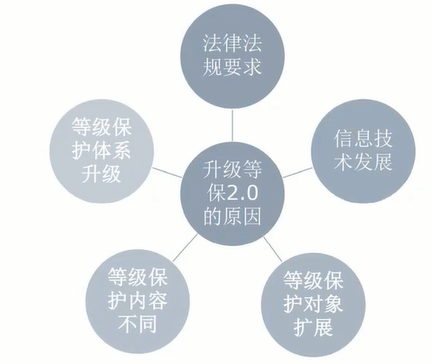
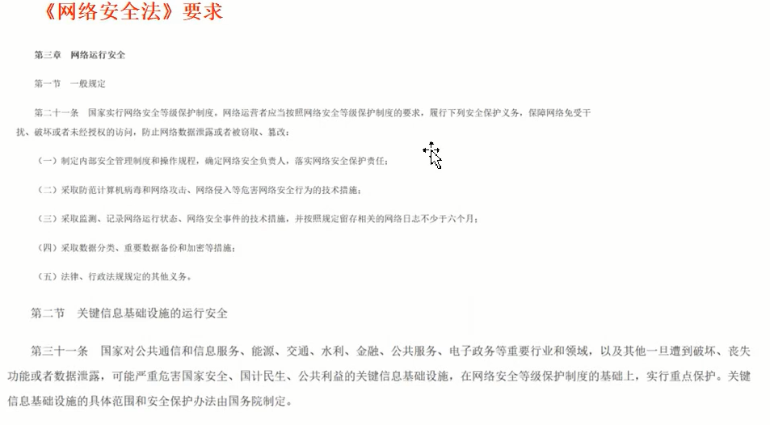
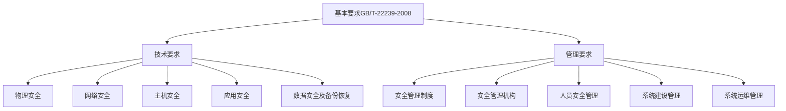
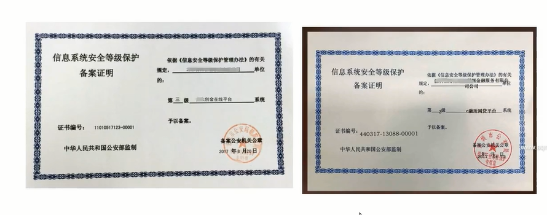

# 等级保护1.0到2.0

## 升级等保2.0的原因

1. 法律法规要求

   - 网络安全法要求

   

   - 其他法规要求
     - 中央关于加强社会治安防控体系建设的意见、 公安改革若干重大问题的框架意见要求“健全完善信息安全等级保护制度”
     - 习近平总书记等中央领导批示要求:健全完善以保护国家关键信息基础设施安全为重点的网络安全等级保护制度。

2. 信息技术发展

   - 当前我们国家正面临经济社会结构调整和转型，信息技术(云计算、大数据、人工智能、物联网等)已经成为新的引擎，可以预见，网络和信息系统作为新兴动力的承载者，必将构建起整个经济社会的神经中枢。重要性带来的必然是安全保障的紧迫性，因此，等级保护将继续扮演不可替代的重要角色。

3. 等级保护对象扩展

   - 大型互联网企业、基础网络、重要信息系统、网站、大数据中心、云计算平台、物联网系
     统、移动互联网、工业控制系统、公众服务平台等等。

4. 等级保护内容不同

   - 风险评估、安全监测、通报预警、案事件调查、数据防护、灾难备份、应急处置、自主可控、供应链安全、效果评价、综治考核等。

5. 等级保护体系升级

   - 等级保护政策体系、标准体系、测评体系、技术体系、服务体系、关键技术研究体系、教育训练体系等。等级保护也将作为核心，围绕它来构建起安全监测、通报预警、快速处置、态势感知、安全防范、精确打击等为--体的国家关键信息基础设施安全保卫体系。

## 等保1.0框架

## 新时期等级保护制度特点

- 一是全新的国家网络安全基本制度体系
- 二是以保护国家关键信息基础设施为重点
- 三是保护策略发生变化、变被动防御为主动防御、变层面防御为综合防御、纵深防御
- 四是保护对象、保护措施发生变化
- 五是法律地位显著提升

## 2.0相比1.0变化

- 增加了云计算安全扩展要求.
- 增加了移动互联安全扩展要求
- 增加了物联网安全扩展要求
- 增加了工业控制系统安全扩展要求

**定级对象变化**
**原来:**信息系统
**改为:**等级保护对象(网络和信息系统)
安全等级保护的对象包洒网络基础设施(厂一电网、电信网、专用用通信网络
等)、云计算平台/系统、大数据平台/系统、物联网、工业控制系统、采用移互联技
术的系统等。

**安全要求的变化**
**原来:**安全要求
**改为:**安全通用要求和安全扩展要求
安全通用要求是不管等级保护对象形态如何必须满足的要求，针对于计算、移动
互联、物联网和工业控制系统提出了特殊要求，称为安全扩展要求。

## 系统备案

**二级以上信息系统:**由网络安全运营使用单位，到所在地区的县级以上公安机关网络安全保卫部门办理备案手续。

**受理备案与审核:**
由公安机关受理备案，按照《信息安全等级保护备案实施细则》要求，对备案材料进行审核，定级准确、材料符合要求的颁发由公安部统一监制的备案证明。

